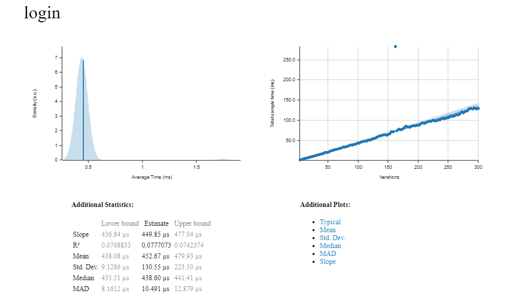
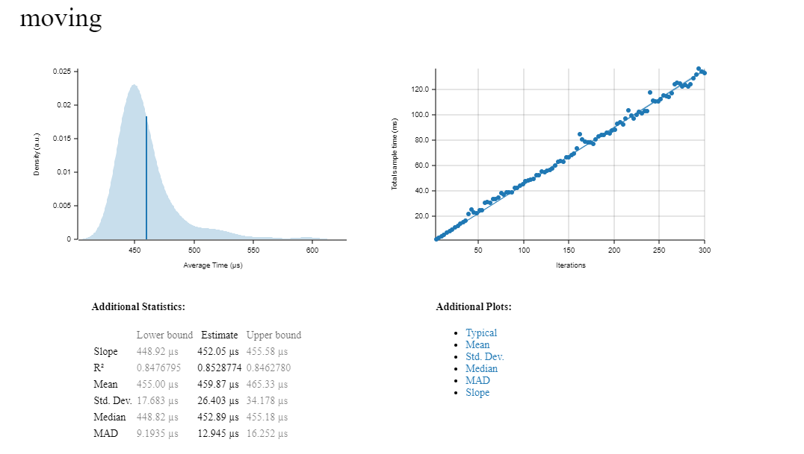
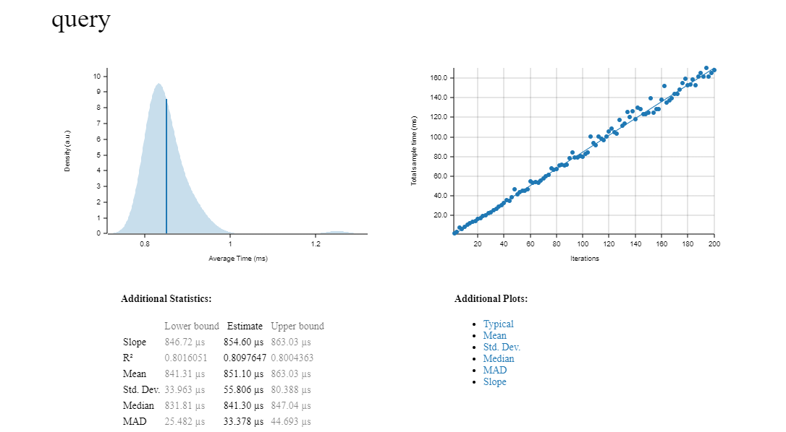
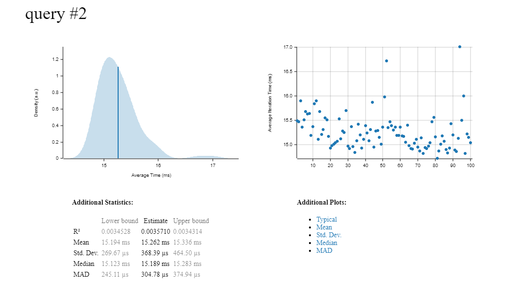

# Login
> Logined 23341 players in 11949ms, RPS: 1953



设置最大人数1000（扩容）最小250（缩容），用户按照zone分布在自动扩容后的48台服务器内
```
2023-06-16T08:57:47.359008Z  INFO scaling_moniter: game_server::dispatcher: checking, totally 23341 players
2023-06-16T08:57:47.370603Z  INFO scaling_moniter: game_server::dispatcher: server_id=2 overhead=714 server.zones=[1321, 1322]
2023-06-16T08:57:47.370637Z  INFO scaling_moniter: game_server::dispatcher: server_id=18 overhead=708 server.zones=[1412, 1413]
2023-06-16T08:57:47.370651Z  INFO scaling_moniter: game_server::dispatcher: server_id=38 overhead=354 server.zones=[1443]
2023-06-16T08:57:47.370662Z  INFO scaling_moniter: game_server::dispatcher: server_id=26 overhead=380 server.zones=[1334]
2023-06-16T08:57:47.370673Z  INFO scaling_moniter: game_server::dispatcher: server_id=21 overhead=375 server.zones=[1312]
2023-06-16T08:57:47.370684Z  INFO scaling_moniter: game_server::dispatcher: server_id=25 overhead=385 server.zones=[1414]
2023-06-16T08:57:47.370694Z  INFO scaling_moniter: game_server::dispatcher: server_id=4 overhead=701 server.zones=[1142, 1143]
2023-06-16T08:57:47.370708Z  INFO scaling_moniter: game_server::dispatcher: server_id=1 overhead=674 server.zones=[1221, 1222]
2023-06-16T08:57:47.370718Z  INFO scaling_moniter: game_server::dispatcher: server_id=32 overhead=653 server.zones=[1421, 1422]
2023-06-16T08:57:47.370730Z  INFO scaling_moniter: game_server::dispatcher: server_id=19 overhead=714 server.zones=[1121, 1122]
2023-06-16T08:57:47.370741Z  INFO scaling_moniter: game_server::dispatcher: server_id=11 overhead=719 server.zones=[1111, 1112]
2023-06-16T08:57:47.370752Z  INFO scaling_moniter: game_server::dispatcher: server_id=46 overhead=366 server.zones=[1131]
2023-06-16T08:57:47.370764Z  INFO scaling_moniter: game_server::dispatcher: server_id=22 overhead=409 server.zones=[1114]
2023-06-16T08:57:47.370774Z  INFO scaling_moniter: game_server::dispatcher: server_id=31 overhead=379 server.zones=[1342]
2023-06-16T08:57:47.370787Z  INFO scaling_moniter: game_server::dispatcher: server_id=7 overhead=722 server.zones=[1313, 1314]
2023-06-16T08:57:47.370798Z  INFO scaling_moniter: game_server::dispatcher: server_id=0 overhead=681 server.zones=[1441, 1442]
2023-06-16T08:57:47.370811Z  INFO scaling_moniter: game_server::dispatcher: server_id=17 overhead=364 server.zones=[1233]
2023-06-16T08:57:47.370823Z  INFO scaling_moniter: game_server::dispatcher: server_id=37 overhead=370 server.zones=[1323]
2023-06-16T08:57:47.370834Z  INFO scaling_moniter: game_server::dispatcher: server_id=10 overhead=723 server.zones=[1332, 1333]
2023-06-16T08:57:47.370844Z  INFO scaling_moniter: game_server::dispatcher: server_id=28 overhead=386 server.zones=[1434]
2023-06-16T08:57:47.370855Z  INFO scaling_moniter: game_server::dispatcher: server_id=42 overhead=370 server.zones=[1424]
2023-06-16T08:57:47.370867Z  INFO scaling_moniter: game_server::dispatcher: server_id=13 overhead=375 server.zones=[1241]
2023-06-16T08:57:47.370877Z  INFO scaling_moniter: game_server::dispatcher: server_id=6 overhead=390 server.zones=[1242]
2023-06-16T08:57:47.370888Z  INFO scaling_moniter: game_server::dispatcher: server_id=35 overhead=371 server.zones=[1324]
2023-06-16T08:57:47.370900Z  INFO scaling_moniter: game_server::dispatcher: server_id=16 overhead=390 server.zones=[1432]
2023-06-16T08:57:47.370910Z  INFO scaling_moniter: game_server::dispatcher: server_id=45 overhead=358 server.zones=[1144]
2023-06-16T08:57:47.370921Z  INFO scaling_moniter: game_server::dispatcher: server_id=33 overhead=709 server.zones=[1132, 1134]
2023-06-16T08:57:47.370933Z  INFO scaling_moniter: game_server::dispatcher: server_id=40 overhead=369 server.zones=[1141]
2023-06-16T08:57:47.370943Z  INFO scaling_moniter: game_server::dispatcher: server_id=34 overhead=371 server.zones=[1113]
2023-06-16T08:57:47.370956Z  INFO scaling_moniter: game_server::dispatcher: server_id=9 overhead=689 server.zones=[1211, 1212]
2023-06-16T08:57:47.370967Z  INFO scaling_moniter: game_server::dispatcher: server_id=29 overhead=375 server.zones=[1213]
2023-06-16T08:57:47.370980Z  INFO scaling_moniter: game_server::dispatcher: server_id=3 overhead=732 server.zones=[1243, 1244]
2023-06-16T08:57:47.370992Z  INFO scaling_moniter: game_server::dispatcher: server_id=24 overhead=397 server.zones=[1214]
2023-06-16T08:57:47.371002Z  INFO scaling_moniter: game_server::dispatcher: server_id=12 overhead=702 server.zones=[1431, 1433]
2023-06-16T08:57:47.371013Z  INFO scaling_moniter: game_server::dispatcher: server_id=30 overhead=364 server.zones=[1223]
2023-06-16T08:57:47.371023Z  INFO scaling_moniter: game_server::dispatcher: server_id=39 overhead=371 server.zones=[1341]
2023-06-16T08:57:47.371034Z  INFO scaling_moniter: game_server::dispatcher: server_id=8 overhead=407 server.zones=[1311]
2023-06-16T08:57:47.371046Z  INFO scaling_moniter: game_server::dispatcher: server_id=15 overhead=720 server.zones=[1343, 1344]
2023-06-16T08:57:47.371056Z  INFO scaling_moniter: game_server::dispatcher: server_id=20 overhead=392 server.zones=[1331]
2023-06-16T08:57:47.371067Z  INFO scaling_moniter: game_server::dispatcher: server_id=14 overhead=384 server.zones=[1232]
2023-06-16T08:57:47.371079Z  INFO scaling_moniter: game_server::dispatcher: server_id=44 overhead=367 server.zones=[1423]
2023-06-16T08:57:47.371089Z  INFO scaling_moniter: game_server::dispatcher: server_id=47 overhead=353 server.zones=[1444]
2023-06-16T08:57:47.371099Z  INFO scaling_moniter: game_server::dispatcher: server_id=5 overhead=719 server.zones=[1231, 1234]
2023-06-16T08:57:47.371115Z  INFO scaling_moniter: game_server::dispatcher: server_id=43 overhead=369 server.zones=[1124]
2023-06-16T08:57:47.371126Z  INFO scaling_moniter: game_server::dispatcher: server_id=36 overhead=379 server.zones=[1411]
2023-06-16T08:57:47.371137Z  INFO scaling_moniter: game_server::dispatcher: server_id=23 overhead=389 server.zones=[1224]
2023-06-16T08:57:47.371149Z  INFO scaling_moniter: game_server::dispatcher: server_id=27 overhead=379 server.zones=[1123]
2023-06-16T08:57:47.371161Z  INFO scaling_moniter: game_server::dispatcher: server_id=41 overhead=373 server.zones=[1133]
```

# Moving
随机用户进行随机移动

> Moving 23341 times in 12173ms, RPS: 1917



# Query
## 100范围检索
> Query x:100,y:100 14195 times in 13585ms, RPS: 1044



## 全图检索
> Query x:1000000,y:1000000 655 times in 10851ms, RPS: 60

